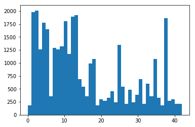
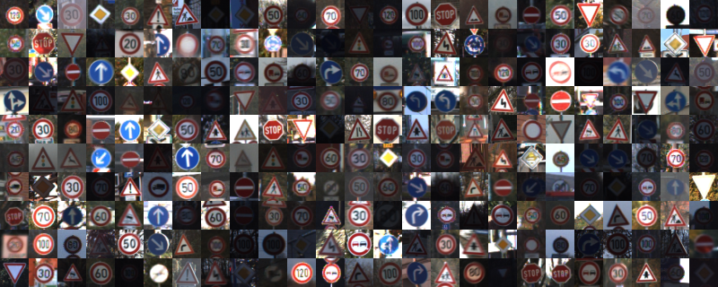
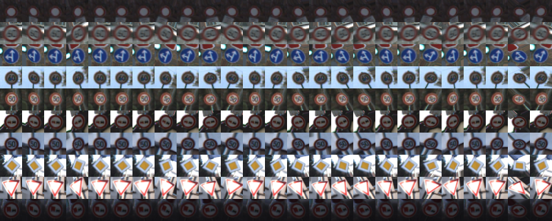
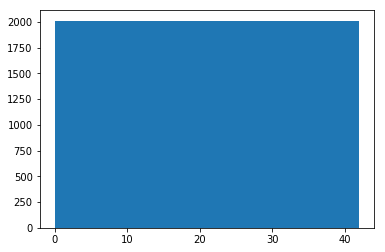
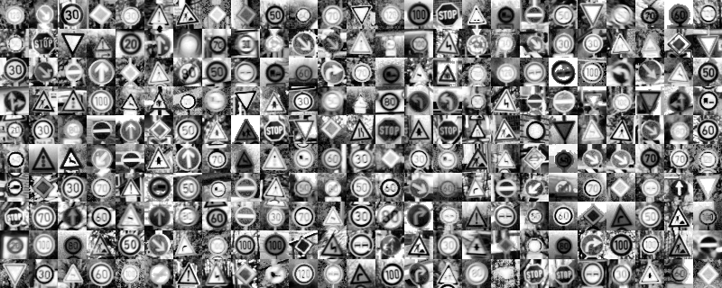
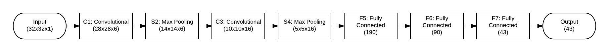
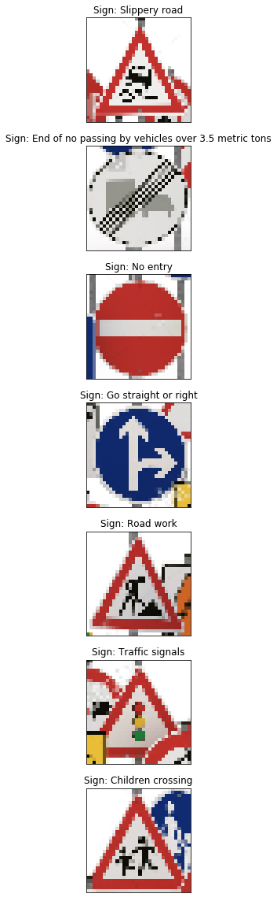
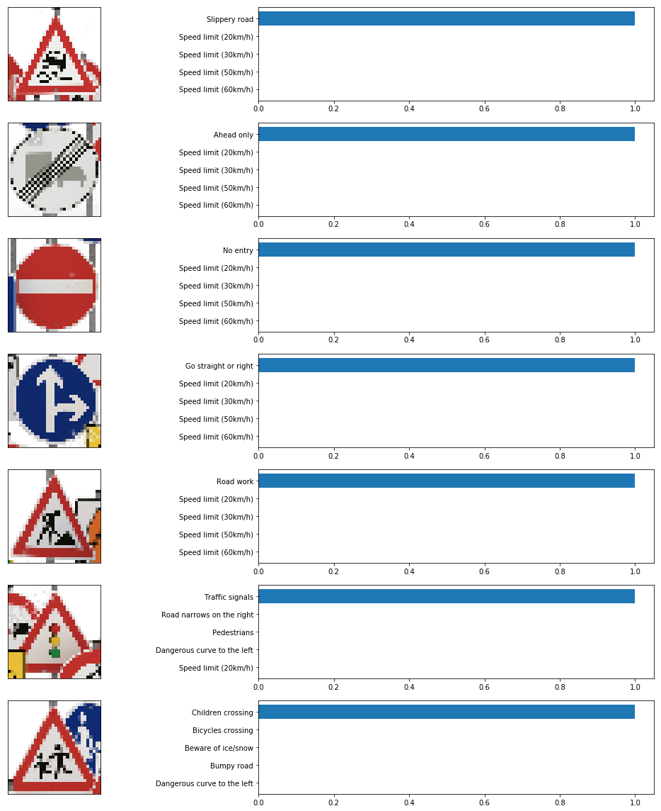

# Traffic Sign Recognition

## Files Submitted

* [Report](report.pdf);
* [Source](Traffic_Sign_Classifier.ipynb).

## Dataset Exploration

### Dataset Summary

The [downloaded dataset](https://d17h27t6h515a5.cloudfront.net/topher/2017/February/5898cd6f_traffic-signs-data/traffic-signs-data.zip) was comprised of traffic sign images, where each image was 32 pixels wide, 32 pixels tall and 24-bit colors. In total we had:

* 34,799 training examples;
* 12,630 testing examples;
* 43 distinct classes.

### Exploratory Visualization

Here is a random sample of 250 traffic signs from the training dataset:

It is noteworthy the pictures were taken with various light conditions and some are quite hard to read.

### Augmented Dataset

The dataset distribution was very irregular and that could negatively impact the training and performance of our model.

This could be mitigated by augmenting the original dataset by generating variations of the signs with lower frequencies.

I decided to rotate those signs by ± 30 degrees in each of the 3 axis, giving an illusion of perspective:

By doing this, I was able to increase the training dataset size from **34,799** to **86,430** samples with uniform distribution:

## Design and Test a Model Architecture

### Preprocessing

The images were pre-processed with only 2 steps:

1. Conversion from 24-bit color space into 8-bit grayscale using `cv2.cvtColor`. Although colors can be an important signal to help identify traffic signs, they must remain distinct if converted to grayscale. The reduced color space can simplify architecture and reduce the demand for computational resources;

2. Normalization via `cv2.equalizeHist`. This would increase contrast and highlight the important features.

 
### Model Architecture

The model employed was based on the LeNet implemented in a previous lab, with minimal changes to produce logits with **43** classes instead of **10**:

### Model Training

Since the input images should contain a single traffic sign, the `tf.nn.softmax_cross_entropy_with_logits` function was choosen as optmizer:  

> Computes softmax cross entropy between logits and labels.
> Measures the probability error in discrete classification tasks in which the classes are mutually exclusive (each entry is in exactly one class).

The `tf.nn.sparse_softmax_cross_entropy_with_logits` function would be another suitable optimizer, but it wasn't evaluated at this time.

### Solution Approach

After over a dozen iterations, tweaking each hyperparameter individually, the best results were achieved with the following values:

* Number of epochs: **120**;
* Batch size: **128**;
* Learning rate: **0.001**.

That lead to the following accuracy:

* Validation set: **93.1%**;
* Test set: **89.6%**.

I also wrote a script to extract a segment from an image, given its URL and use it to create an addtional test set with traffics signs images found on the World Wide Web. Like the one bellow:

From that original image, I chose 7 that had belong to the 43 classes we used to train our model: 

After running those images against the trained model, the result was:

Sign | Prediction | Hit
-----| -----------|----
Slippery road | Slippery road | :heavy_check_mark:
End of no passing by vehicles over 3.5 metric tons | Ahead only | :x:
No entry | No entry | :heavy_check_mark:
Go straight or right | Go straight or right | :heavy_check_mark:
Road work Prediction | Road work | :heavy_check_mark:
Traffic signals | Traffic signals | :heavy_check_mark:
Children crossing | Children crossing | :heavy_check_mark:

That is **6** out **7** or **85.7%** accuracy.

Digging down into the top five predictions for each sign:

It was a surprise that every top prediction was close to 100% of confidence. Smells like overfitting?

## Final Thoughts

The results are far from stellar and definetelly not even close to a solution that could be shipped and used in the real world.

Some areas where I could have invested more time:

* **Image pre-processing**: remove the background, leaving only the region that encompasses the sign. That should straight-forward, since all signs fall into a limited class of geometric shapes (circle, triangle, rectangle, etc). Another step of normalization, after the background removal;
* **Model architecture**: LeNet has an incredible accuracy for a much simpler problem and it was surprising to perform reasonably well to classify trafic signs, but I could spent some time researching papers about other architectures that could perform better.

All things considered, I am extremely satisfied to learn so much about Python (and so many libraries), while experimenting with a real world application for CNNs.
