#**Traffic Sign Recognition** 

## Data Exploration
### Summary
Following is the summary of the data set performed using `numpy`:

Number of training examples:   34799
Number of validation examples: 4410
Number of testing examples:    12630
Image data shape:              (32, 32, 3)
Number of classes:             43

### Example Images
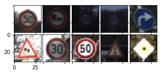

### Distribution of images classes
Following is the distribution of image classes among the train, validation and test sets:
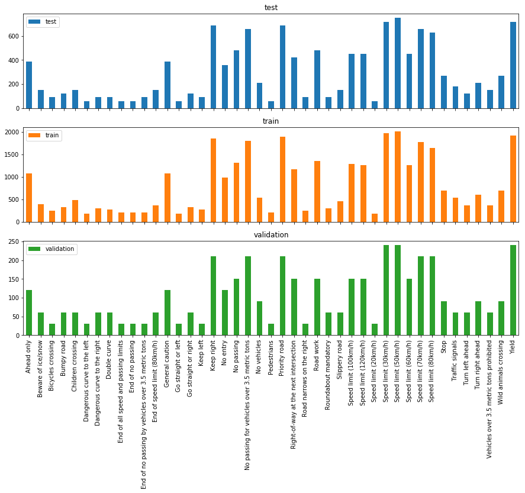

As seen in the histogram, the shape of the distribution of classes among the three data sets is identical. However, certain image classes have a strong representation while certain others have a weak representation.

## Data Preprocessing
The data proprocessing is performed using `sklearn` and `scipy`.

### Augmentation
The training set is augmented by including images rotated by +10 deg/-10 deg and adding blurred images (thorugh Gaussian noise). The augmentation gives the model to see more variations of each image class allowing it to train better.

### YUV Conversion
The images were converted from RGB color space to YUV space. This is inline with the commonly image preprocessing techniques. For example a similar conversion was done in [Traffic Sign Recognition with Multi-Scale Convolutional Networks](http://yann.lecun.com/exdb/publis/pdf/sermanet-ijcnn-11.pdf).
Although grayscale images produced better results in the paper cited above, I decided to do my classification with color to take into account the different colored traffic signs.

### Zero centering and normalization
The mean and variance of the training data set is computed.
These are then used to zero center the training set and normalize it using the variance. This is done to avoid features with large values dominating the contribution to the activation function. Normalization ensures that the data features are approximately of the same scale.

The validation and test sets are also preprocessed using the same mean and variance (of the training set).

## Model Architecture
A convolution neural network is used for the classifying the traffic signs. Convolution takes advantage of the spatial relationship between pixel data of images.
The architecture consists of convolution layers intermingled with max pooling to reduce feature size. These are followed by fully connected layers. The ReLu activation function is used for non-linearity except in the last layer outputting logits. The input to the activation function is batch normalized to reduce the variance in the activation input. Dropout is used between the fully connected layers to avoid over-fitting

|Layer  	|Input   	|Output   	|Parameters
|---	|---	|---	|---	|---	|
| Input  	| -  	| (N, 32, 32, 3) RGB images 	|   	|   	|
| Convolution  	| (N, 32, 32, 3)  	| (N, 30, 30, 6)  	| 3x3 filter with stride=1, padding=VALID and depth=6  	|
| Convolution  	| (N, 30, 30, 6)  	| (N, 28, 28, 16)  	| 3x3 filter with stride=1, padding=VALID and depth=16  	|
| Max Pool  	| (N, 28, 28, 16)  	| (N, 14, 14, 16)  	| 2x2 filter with stride=2  	|
| Convolution 	| (N, 14, 14, 16)  	| (N, 12, 12, 24)  	| 3x3 filter with stride=1, padding=VALID and depth=24  	|
| Convolution 	| (N, 12, 12, 24)  	| (N, 10, 10, 36)  	| 3x3 filter with stride=1 and depth=36  	|
| Max Pool 	| (N, 10, 10, 36)  	| (N, 5, 5, 36)  	| 2x2 filter with stride=2  	|
| Convolution 	| (N, 5, 5, 36)  	| (N, 3, 3, 48)  	| 3x3 filter with stride=1, padding=VALID and depth=48  	|
| Fully Connected 	| (N, 432)  	| (N, 120)  	| Hidden features: 120  	|
| Dropout 	| -  	| -  	| Probability: 0.5 |  	
| Fully Connected 	| (N, 120)  	| (N, 84)  	| Hidden features: 84  	|
| Dropout 	| -  	| -  	| Probability: 0.5 |  	
| Logits 	| (N, 84)  	| (N, 43)  	| Classes: 43  	|

The model architecture is inspired by _LeNet_. Instead of the 5x5 filters, I decided to use 2 3x3 filters which will produce the same feature maps if the depth is held constant. However, I decided to increase the depth as we proceeded between convolution layers to detect more _features_.

## Training
### Initialization
The weights in each layer are initialized using the Xavier initializer. This initializer is designed to keep the scale of the gradients roughly the same in all layers.
The biases are all initialized with zero.

### Loss & Accuracy
The loss consists of two components:

1) _Cross-Entropy_: The cross-entropy loss is computed by measuring the distance between the soft max probabilities derived from the logits and the one-hot encoded labels.
2) _Regularization_: L2 regularization loss is computed for each fully connected layer to prevent over-fitting.

The accuracy is computed as a simple ratio of number of correct predictions to number of number of training samples.

### Hyper-parameter tuning
The training was initially started with the following hyper-parameters:
- Learning Rate: 0.001
- Epochs: 25
- Batch size: Largest permissible (256)
- Regularization strength: 0.1

The accuracy and loss curves were plotted for the training and validation set. 

- Based on the loss curves, the learning rate was reduced until the curve was neither too steep and monotonically decreasing. 
- The epochs were also reduced at the point where the loss reduction had stagnated. 
- The validation accuracy curve's behavior with respect to the training accuracy curve was observed to tune the regularization strength parameter so that the validation accuracy closely followed the traing accuracy.

The final training hyper parameters were:
- Learning Rate: 0.0002
- Epochs: 20
- Batch size: 256
- Regularization strength: 0.5

### Training Results
The training results are as follows:
- Training Loss: 0.773
- Training Accuracy: 0.964
- Validation Loss: 0.852
- Validation Accuracy: __0.950__

## Testing
The test reults (on the test set provided) are as follows:
- Test Loss: 0.899
- Test Accuracy: 0.932

The model performance meets the minimum criteria set out in the project. However, there is room for improvement. The baseline accuracy for this problem is close to 0.99.

Some strategies we adopt include:
1) Further augmentation of image set
2) Fine tuning hyper parameters
3) Revise architecture based on the architectures in literature providing excellent results
4) Preprocess images based on techniques in literature giving excellent results.

## Further Analysis

###Precision & Recall
Below is a plot of precision, recall and F Score of various image classes:
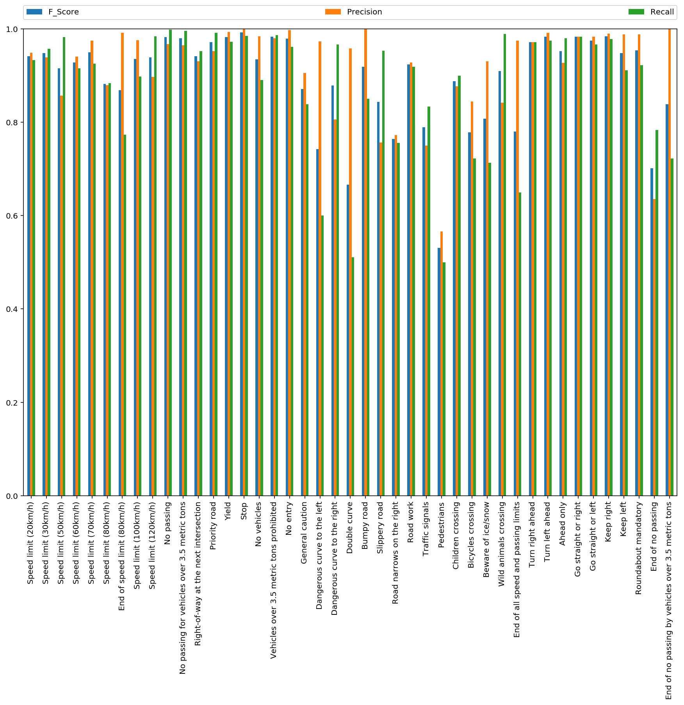
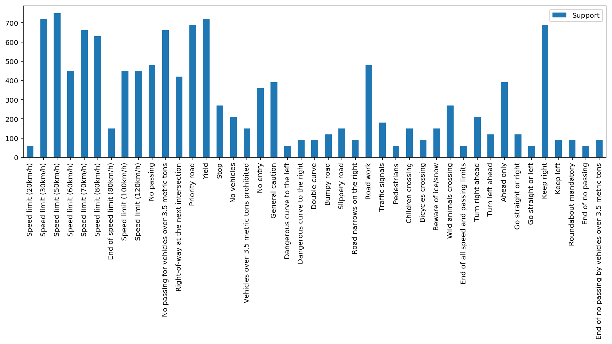

We can see that images classes with low support like (pedestrians) score lower performance metrics than with image classes with higher support (No passing).

Also interesting to note is that some image classes have high precision but lower recall and vice-versa. This information can be used later when analyzing the model performance on new images.

## Testing New Images
We will now analyze the model performance on the following new images:

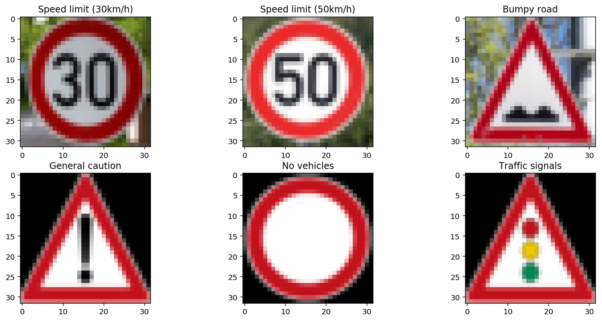

These images go through the same pre-processing piepline as the test set.

The classification results from the model are:

Let's analyze the performance for each image.

_Speed Limit 30 km/h_:
This image is correctly classified by the model. From the Precision/Recall chart, we can see that this image class has a high precision/recall and hence a high F score.
This is confirmed by the model's certainty in classifying this image by looking at the top 5 softmax probabilities:
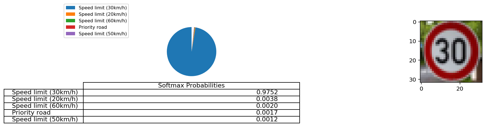

_Speed Limit 50 km/h_:
This image is incorrectly classified by the model. Interestingly, this class has a high recall and low precision. So, we should expect the model to be fairly good at classifying this class. This particular classification instance is characterized by uncertainity between the correct class and the incorrect class which constitute the top 2 softmax probabilities:
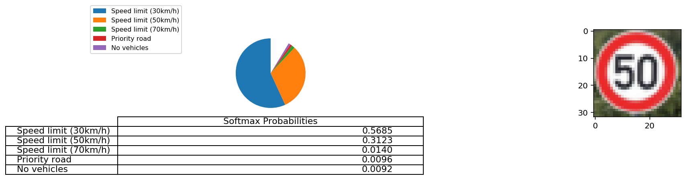

_Bumpy Road_:
This image is incorrectly classified by the model. This class has a low recall with high precision meaning that unless the model is very sure, it will not label an image as _bumpy road_.
Again, the model is not very certain about this incorrect classification:
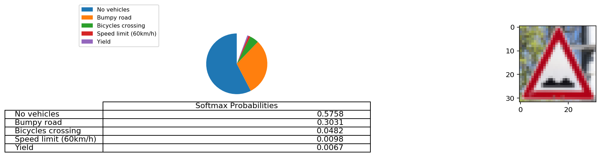

_General Caution_:
This image is correctly classified by the model. This class has fairly good accuracy scores. The example is also free from distortion helping the model. The model prediction is very certain:
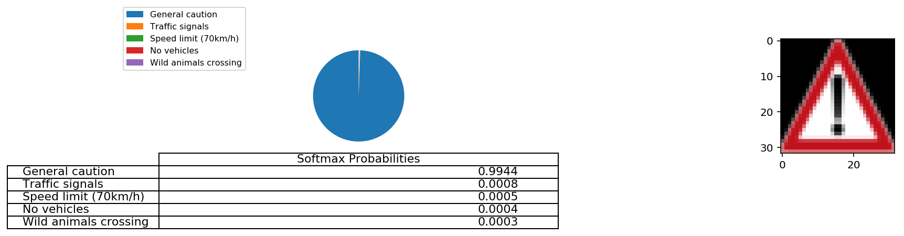

_No Vehicles_:
This image is correctly classified by the model. This class has fairly good accuracy scores. The model prediction is fairy certain:
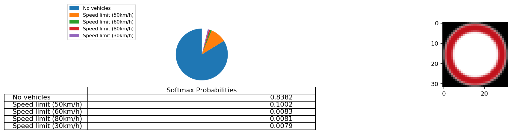

_Traffic Signals_:
This image is an example of a correct classification by the model with a class one of the lower accuracy scores. The model prediction is again certain:
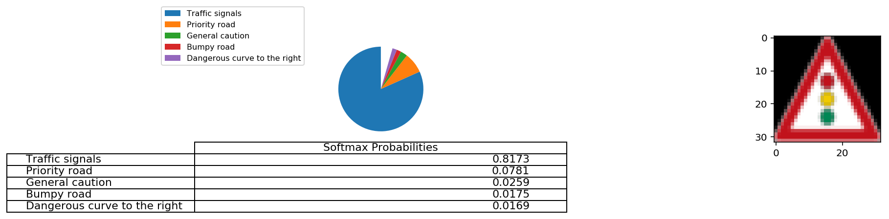

We can see that all the incorrect classifications have the highest probability < 0.6 indicating that the model is not very certain while the correct classifications have the higest probability > 0.8 indicating that the model is confident about its predictions.

## Neural Network State Visualization
The following are the activations of the neural network layers for an example test image of a traffic signal:

The scope of activation narrows down as we pass through the layers. The intermediate layers activate to more complex shapes than the previous layers.

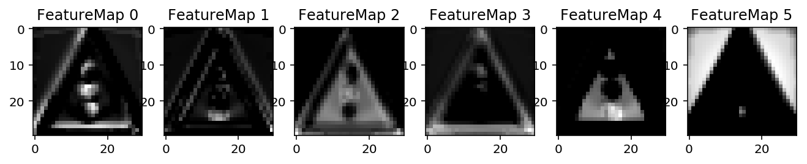

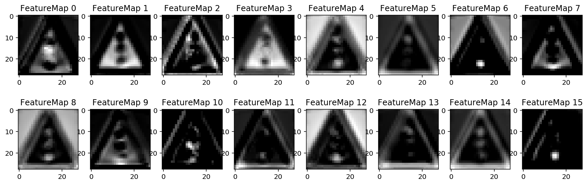

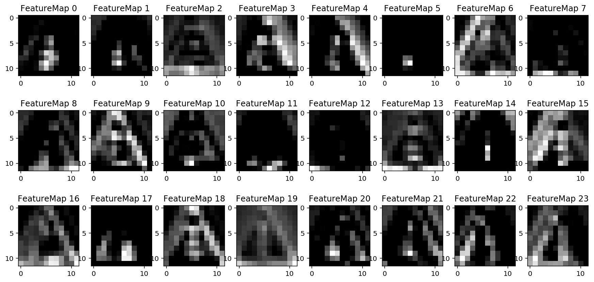

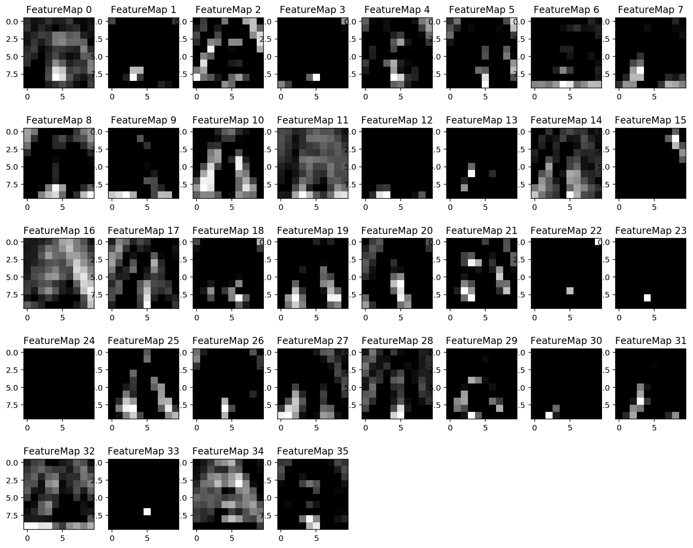

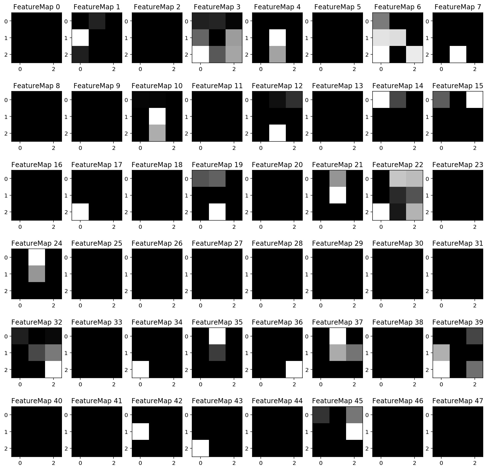