# Classifying Traffic-Signs With Over 97% Accuracy Using Deep-Learning


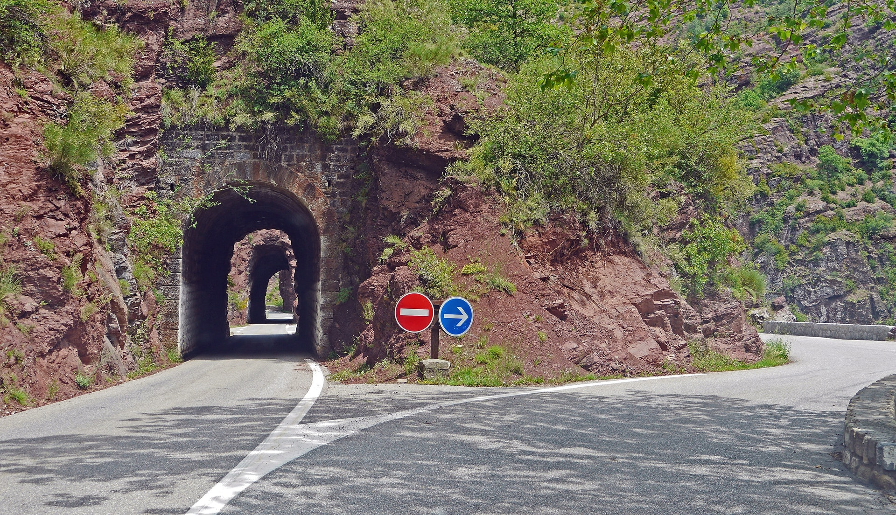

Traffic (or road) signs are an integral part of our road infrastructure. They provide critical information, sometimes compelling recommendations, for road users, which in turn requires them to adjust their driving behaviour to make sure they adhere with whatever road regulation currently enforced. Without such useful signs, we would most likely be faced with more accidents, as drivers would not be given critical _feedback_ on how fast they could safely go, or informed about road works, sharp turn, or school crossings ahead. In our modern age, around 1.3M peope die on roads each year. This number would be much higher without our road signs. <br/>
Naturally, autonomous vehicles must also abide by road legislation and therefore _recognize_ and _understand_ traffic signs.

Traditionally, standard [computer vision](https://en.wikipedia.org/wiki/Computer_vision) methods were employed to detect and classify traffic signs, but these required considerable and time-consuming manual work to extract important features in images. Instead, by applying deep learning to this problem, we create a model that reliably classifies traffic signs, learning to identify the most appropriate features for this problem by _itself_. In this article, I show how we can create a deep learning architecture that can identify traffic signs with close to **98% accuracy**. This is project 2 of Term 1 of the [Udacity Self-Driving Car Engineer Nanodegree](https://www.udacity.com/course/self-driving-car-engineer-nanodegree--nd013).

## Project Setup
The dataset is plit into training, test and validation sets, with the following characteristics:
* Images are 32 (width) x 32 (height) x 3 (RGB color channels)  
* Training set is composed of 34799 images 
* Validation set is composed of 4410 images
* Test set is composed of 12630 images
* There are 43 classes (e.g. Speed Limit 20km/h, No entry, Bumpy road, etc.)

Moreover, we will be using Python 3.5 with Tensorflow to write our code.

### Images and Distribution
You can see below a sample of the images from the dataset. Some of them are quite dark so we will look to improve contrast a bit later.<br/>


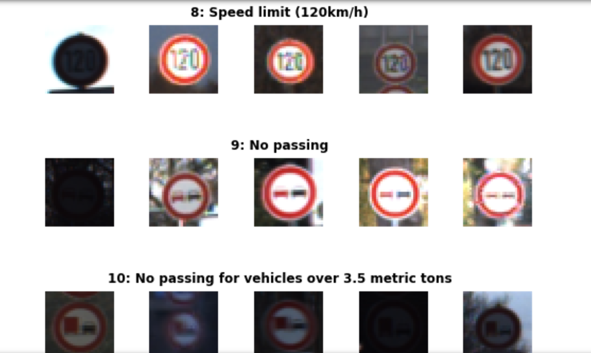

There is also a significant imbalance across classes in the training set, as shown in the histogram below. Some classes have less than 200 images, while others have over 2000. **This means that our model could be biased towards over-represented classes, especially when it is unsure in its predictions**. We will see later how we can mitigate this discrepancy using data augmentation.


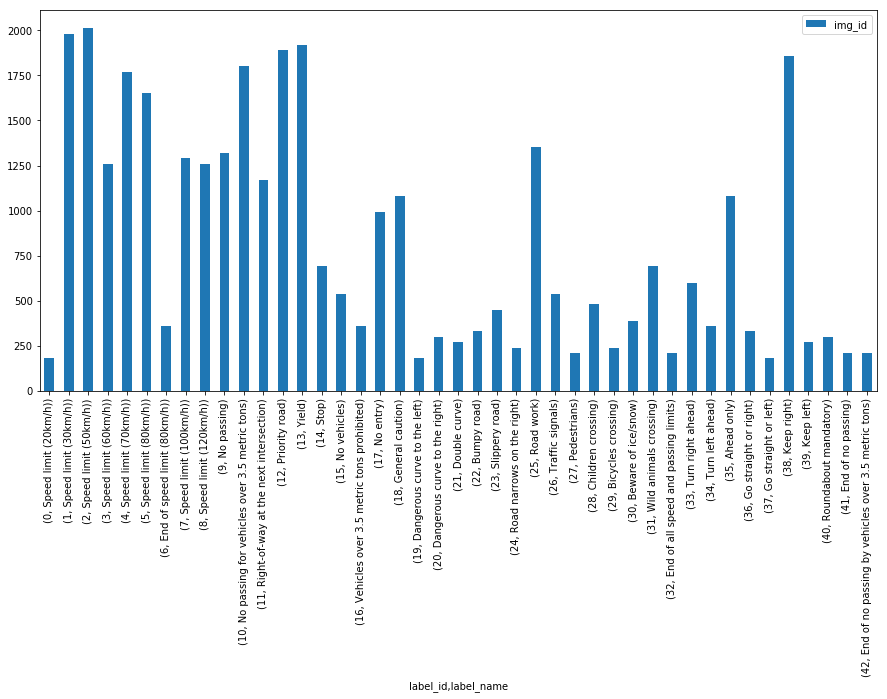


## Pre-Pocessing Steps

We initially apply two pre-processing steps to our images:

### Grayscale
We convert our 3 channel image to a single grayscale image (we do the same thing in project 1 - Lane Line Detection - you can read my blog post about it [HERE](https://medium.com/computer-car/udacity-self-driving-car-nanodegree-project-1-finding-lane-lines-9cd6a846c58c)).

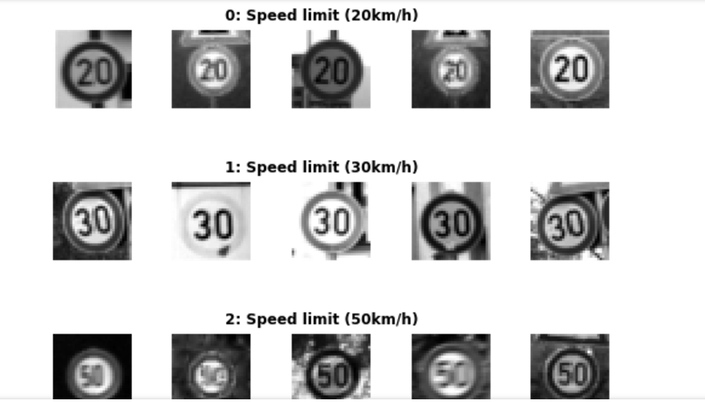

### Image Normalisation
We center the distribution of the image dataset by subtracting each image by the dataset mean and divide by its standard deviation. This helps our model treating images uniformly. The resulting images look as follows:

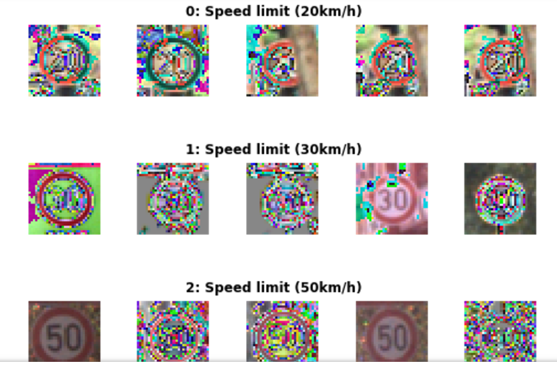

## Model Architecture
The architecture proposed is inspired from Yann Le Cun's [paper](http://yann.lecun.com/exdb/publis/pdf/sermanet-ijcnn-11.pdf) on classification of traffic signs. We added a few tweaks and created a modular codebase which allows us to try out different filter sizes, depth, and number of convolution layers, as well as the dimensions of fully connected layers. In homage to Le Cun, and with a touch of cheekiness, we called such network _EdLeNet_ :).

We mainly tried 5x5 and 3x3 filter fizes, and start with depth of 32 for our first convolutional layer. The 3x3 architecture is shown below:

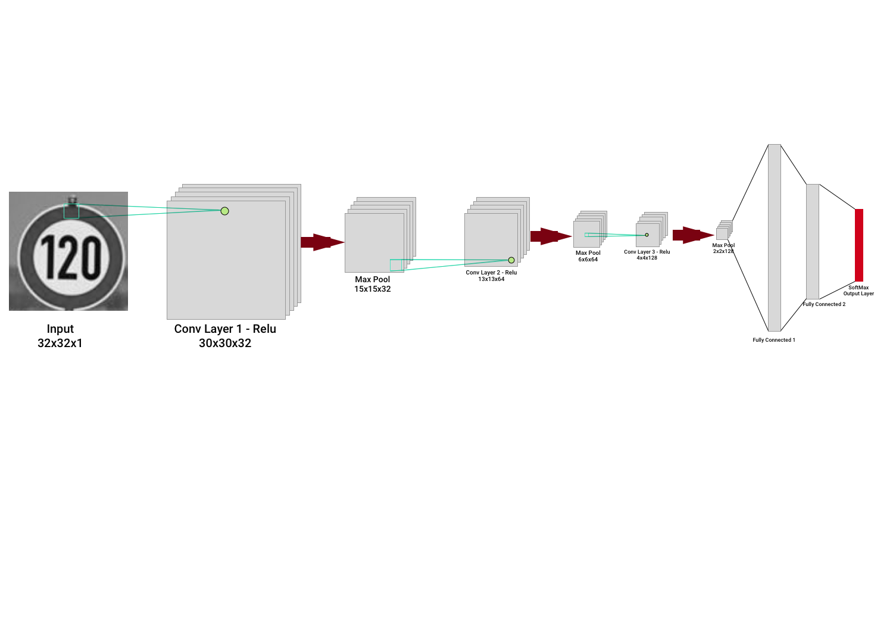

We build a highly modular coding infrastructure that enables us to _dynamically_ create our models like in the following snipets:
```
mc_3x3 = ModelConfig(EdLeNet, "EdLeNet_Norm_Grayscale_3x3_Dropout_0.50", [32, 32, 1], [3, 32, 3], [120, 84], n_classes, [0.75, 0.5])
mc_5x5 = ModelConfig(EdLeNet, "EdLeNet_Norm_Grayscale_5x5_Dropout_0.50", [32, 32, 1], [5, 32, 2], [120, 84], n_classes, [0.75, 0.5])

me_g_norm_drpt_0_50_3x3 = ModelExecutor(mc_3x3)
me_g_norm_drpt_0_50_5x5 = ModelExecutor(mc_5x5)
``` 

The `ModelConfig` contains information about the model such as 
* The model function (e.g. `EdLeNet`)
* the model name
* input format (e.g. [32, 32, 1] for grayscale), 
* convolutional layers config [filter size, start depth, number of layers], 
* fully connected layers dimensions (e.g. [120, 84]), number of classes
* dropout keep percentage values [p-conv, p-fc] 

The `ModelExecutor` is reponsible for _training_, _evaluating_, _predicting_, and producing visualizations of our _activation_ maps.

To better isolate our models and make sure they do not all exist under the same Tensorflow graph, we use the following useful construct:
```
self.graph = tf.Graph()
with self.graph.as_default() as g:
    with g.name_scope( self.model_config.name ) as scope:

...

with tf.Session(graph = self.graph) as sess:
```

This way, we create separate graphs for _every_ model, making sure there is no mixing of our variables, placeholders etc. It's saved me a lot of headaches. 

We actually started with a depth of 16, but better results with 32 so settled on this value. We also compared color vs grayscale,standard **and** normalised images, and saw that grayscale tended to outperform grayscale. Unfortunately, we never got close enough to 93% test set accuracy on 3x3 or 5x5 models: our best model (3x3 grayscale) seemed to max-out at around 91% test accuracy. Moreover, we observed some erratic loss behaviour on the validation set after a given number of epochs, which actually meant our model was overfitting on the training set and not generalising. You can see below some of our metric graphs for different model configurations.

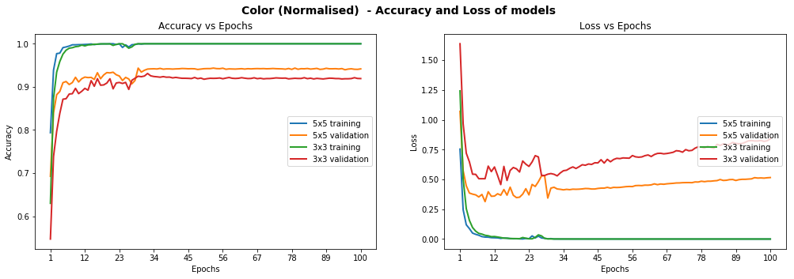

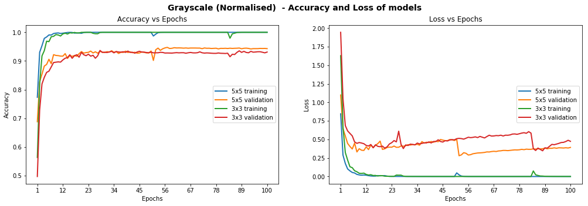

### Dropout

In order to improve the model reliability, we turned to dropout, which is a form of regularisation where weights are kept with a probability _p_: the unkept weights are thus "dropped". This prevents the model from overfitting. Dropout was introduced by Geoff Hinton, a pioneer in the deep learning space. His group's [paper](http://jmlr.org/papers/volume15/srivastava14a/srivastava14a.pdf) on this topic is a must read to better understand the motivations behind the authors. There's also a fascinating parallel with biology and evolution.<br/>
In the paper, the authors apply varying degrees of dropout, depending on the type of layer. I therefore decide to adopt a similar approach, defining two levels of dropout, one for convolutional layers, the other for fully connected layers:
```
p-conv: probability of keep weight in convolutional layer
p-fc: probability of keeping weight in fully connected layer
```
Moreover, the authors gradually adopted more aggressive values of dropout as they go deeper in the network. Therefore I also decided:
```
p-conv >= p-fc
```
that is, we will keep weights with a greater than or equal probability in the convolutional than fully connected layers. The way to reason about this is that we treat the network as a funnel and therefore want to gradually _tighten_ it as we move deeper into the layers: we don't want to discard too much information at the start as some of it would be extremely valuable. Besides, as we apply [MaxPooling](https://www.quora.com/What-is-max-pooling-in-convolutional-neural-networks) in the convolutional layers, we are already losing a bit of information.

We tried different paratemers but ultimately settled on _p-conv=0.75_ and _p-fc=0.5_, which enabled us to achieve a test set accuracy of 97.55% on normalised grayscale images with the 3x3 model. Interestingly, we achieved over 98.3% accuracy on the validation set:
```
Training EdLeNet_Norm_Grayscale_3x3_Dropout_0.50 [epochs=100, batch_size=512]...

[1]	total=5.222s | train: time=3.139s, loss=3.4993, acc=0.1047 | val: time=2.083s, loss=3.5613, acc=0.1007
[10]	total=5.190s | train: time=3.122s, loss=0.2589, acc=0.9360 | val: time=2.067s, loss=0.3260, acc=0.8973
...
[90]	total=5.193s | train: time=3.120s, loss=0.0006, acc=0.9999 | val: time=2.074s, loss=0.0747, acc=0.9841
[100]	total=5.191s | train: time=3.123s, loss=0.0004, acc=1.0000 | val: time=2.068s, loss=0.0849, acc=0.9832
Model ./models/EdLeNet_Norm_Grayscale_3x3_Dropout_0.50.chkpt saved
[EdLeNet_Norm_Grayscale_3x3_Dropout_0.50 - Test Set]	time=0.686s, loss=0.1119, acc=0.9755
```

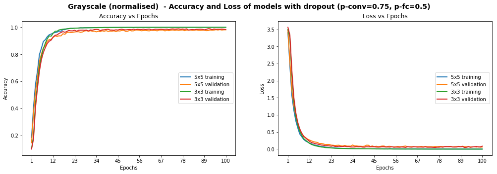


The graph above shows that the model is _smooth_, unlike some of the graphs higher up. We have already achieved the objective of scoring over 93% accuracy on the test set, but can we do better? Remember that some of the images were blurry and the distribution of images per class was very uneven. We explore below additional techniques we used to tackle each point.

## Histogram Equalization

[Histogram Equalization](https://en.wikipedia.org/wiki/Histogram_equalization) is a computer vision technique used to increase the [contrast](https://en.wikipedia.org/wiki/Contrast_(vision)) in images. As some of our images suffer from low contrast (blurry, dark), we will improve visibility by applying OpenCV's [Contrast Limiting Adaptive Histogram Equalization](http://docs.opencv.org/3.0-beta/doc/py_tutorials/py_imgproc/py_histograms/py_histogram_equalization/py_histogram_equalization.html) (aka CLAHE) function.

We once again try various configurations, and find the best results, with **test accuracy of 97.75%**, on the 3x3 model using the following dropout values: _p-conv=0.6_, _p-fc=0.5_ .
```
Training EdLeNet_Grayscale_CLAHE_Norm_Take-2_3x3_Dropout_0.50 [epochs=500, batch_size=512]...

[1]	total=5.194s | train: time=3.137s, loss=3.6254, acc=0.0662 | val: time=2.058s, loss=3.6405, acc=0.0655
[10]	total=5.155s | train: time=3.115s, loss=0.8645, acc=0.7121 | val: time=2.040s, loss=0.9159, acc=0.6819
...
[480]	total=5.149s | train: time=3.106s, loss=0.0009, acc=0.9998 | val: time=2.042s, loss=0.0355, acc=0.9884
[490]	total=5.148s | train: time=3.106s, loss=0.0007, acc=0.9998 | val: time=2.042s, loss=0.0390, acc=0.9884
[500]	total=5.148s | train: time=3.104s, loss=0.0006, acc=0.9999 | val: time=2.044s, loss=0.0420, acc=0.9862
Model ./models/EdLeNet_Grayscale_CLAHE_Norm_Take-2_3x3_Dropout_0.50.chkpt saved
[EdLeNet_Grayscale_CLAHE_Norm_Take-2_3x3_Dropout_0.50 - Test Set]	time=0.675s, loss=0.0890, acc=0.9775
```

We show graphs of previous runs where we tested the 5x5 model as well, over 220 epochs. We can see a much smoother curve here, reinforcing our intuition that the model we have is more stable. 

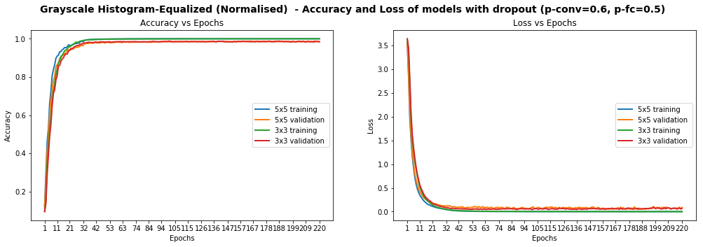

We identified 269 images that are model could not identify correctly. We display 10  of them below, chosen randomly, to conjecture why the model was wrong. <br/>

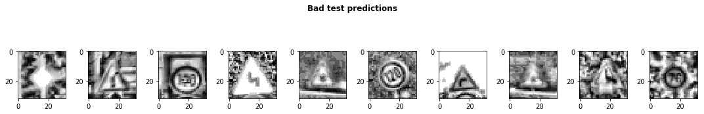


Some of the images are very blurry, despite our histogram equalization, while others seem distored. We probably don't have enough examples of such images in our test set for our model's predictions to improve. Additionally, while 97.75% test accuracy is very good, we still one more ace up our sleeve: data augmentation. 

## Data Augmentation

We observed earlier that the data presented glaring imbalance across the 43 classes. Yet it does not seem to be a crippling problem as we are able to reach very high accuracy despite the class imbalance. We also noticed that some images in the test set are distorted. We are therefore going to use data augmentation techniques in an attempt to:
1. Minimize imbalances across classes
2. Extend dataset and provide additional pictures in different lighting settings and orientations
3. Improve model's ability to become more generic
4. Improve test and validation accuracy, especially on distorted images

We use a nifty library called [imgaug](https://github.com/aleju/imgaug) to create our augmentations. We mainly apply [affine transformations](https://en.wikipedia.org/wiki/Affine_transformation) to augment the images.  Our code looks as follows:
```
def augment_imgs(imgs, p):
    """
    Performs a set of augmentations with with a probability p
    """
    augs =  iaa.SomeOf((2, 4),
          [
              iaa.Crop(px=(0, 10)), # crop images from each side by 0 to 10px (randomly chosen)
              iaa.Multiply((1.0, 1.5)), # change brightness of images (100-150% of original value))
              iaa.Sharpen(alpha=(0.7, 1.0), lightness=(1.05, 1.5)), # sharpen images
              iaa.Affine(scale={"x": (0.8, 1.2), "y": (0.8, 1.2)}),
              iaa.Affine(translate_percent={"x": (-0.2, 0.2), "y": (-0.2, 0.2)}),
              iaa.Affine(rotate=(-45, 45)), # rotate by -45 to +45 degrees)
              iaa.Affine(shear=(-10, 10)) # shear by -10 to +10 degrees
          ])

    
    seq = iaa.Sequential([iaa.Sometimes(p, augs)])
    
    return seq.augment_images(imgs)
```

We also decide to augment the most under-represented classes by 2x while only augmenting the ones that already had data by 10%. Our new dataset looks as follows, with some images augmented and some not:

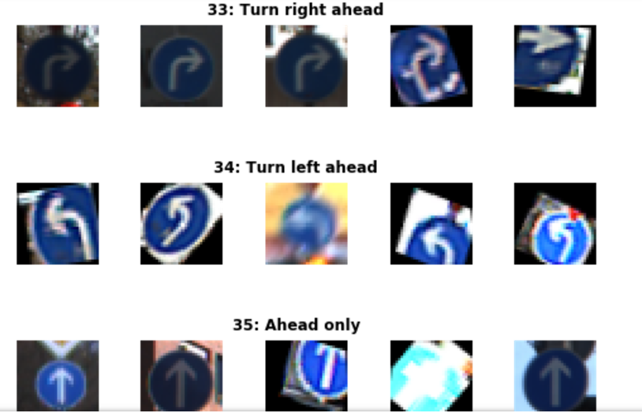

The distribution of our training set now looks as follows:

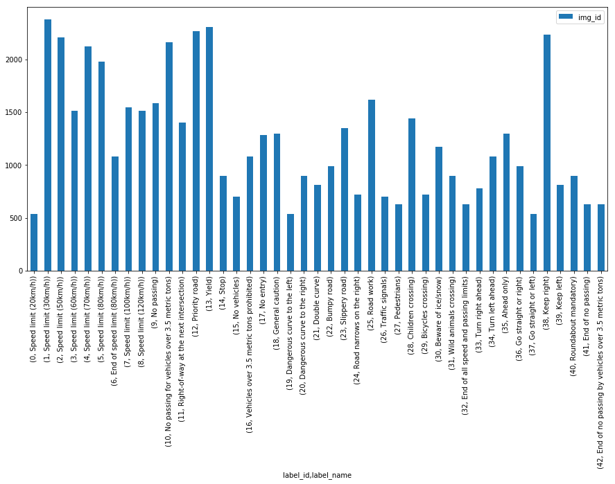


We achieve our best performance...


## Testing Model On New Images

We downloaded five new images and submit them to our model for predictions.


The ground truth for the images is as follows:
```
['Speed limit (120km/h)',
 'Priority road',
 'No vehicles',
 'Road work',
 'Vehicles over 3.5 metric tons prohibited']
```

The Images were chosen because of the following:
* They represent different traffic signs that we currently classify
* They vary in shape and color
* They are under different lighting conditions (the 4th one has sunlight reflection)
* They are under different orientations (the 3rd one is slanted)
* They have different background
* The last image is actually a design, not a real picture, and we wanted to test the model against it to see if it recognizes it
* Some of them are in under-represented classes


The first step we took was to apply the same CLAHE to those new images, resulting in the following:

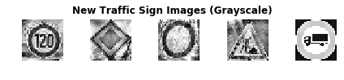


We achieve perfect accuracy of 100% on the new images. On the original test set, we achieved 97.75% accuracy. We could explore blurring our new images or modifying contrast to see how the model handles those changes in the future.

```
new_img_grayscale_norm_pred_acc = np.sum(new_img_lbs == preds) / len(preds)
print("[Grayscale Normalised] Predictional accuracy on new images: {0}%".format(new_img_grayscale_norm_pred_acc * 100))
...
[Grayscale Normalised] Predictional accuracy on new images: 100.0%
```

We also show the top 5 SoftMax probabilities computed for each model, with the green bar showing the ground truth. We can clearly see that our model quite confident in its predictions. In the worst case (last image), the 2 most likely prediction has a probability of around 10<sup>-3</sup>. In fact our model struggles most on the last image, which I believe is actually a design a not even a real picture. Overall, we have developed a strong model!

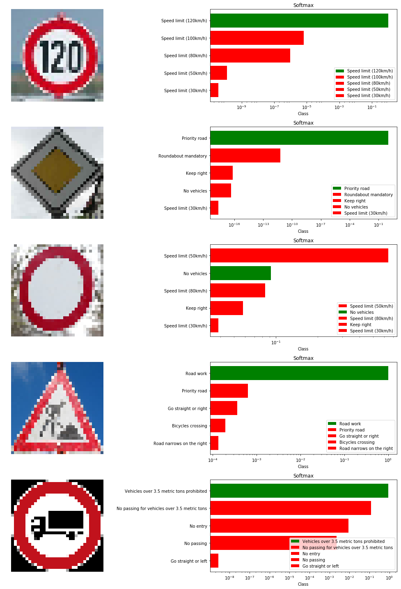

## Visualising Our Activation Maps

We also visualise the activation maps produced by the model for the first image (speed limit 120 km/h), at multiple convolutional layers:

### Layer 1

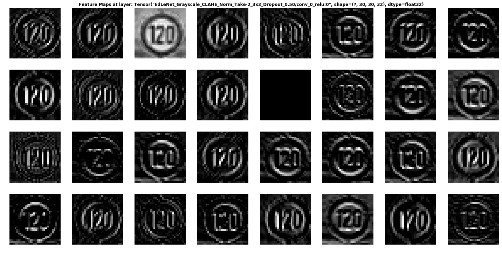

We can see that the network is focusing a lot on the edges of the circle and somehow on the _120_. The background is ignored.

### Layer 2

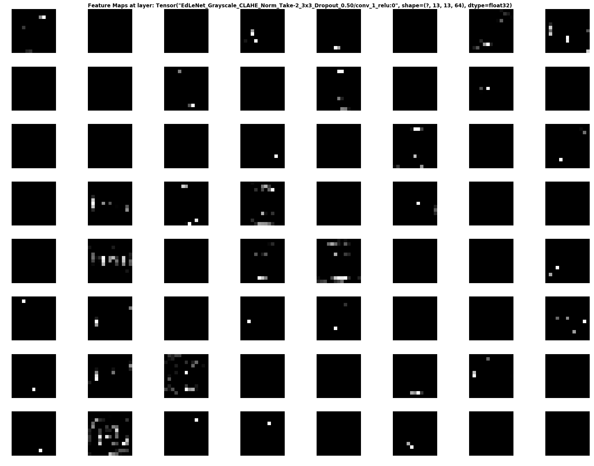

It is rather hard to determine what the network is focusing on in layer 1, but it seems to "activate" around the edges of the circle and in the middle, where our _120_ is printed.

### Layer 3


This activation map is also hard to decipher... But it seems the network reacts to stimuli on the _edges_ and in the middle once again.


## Conclusion

We covered how deep learning can be used to classify traffic signs with high accuracy, employing a variety of pre-processing  and regularization techniques (e.g. dropout), and trying different model architectures. We built highly configurable code and developed a flexible way of evaluating multiple architectures. Our model reached close to 98% accuracy on the test set which is close to the state of the art in this domain.

Personally, I thoroughly enjoyed this project and gained practical experience using Tensorflow, matplotlib and investigating artificial neural network architectures. Moreover, I delved into some seminal papers in this field, which reinforced my understanding and more importantly refined my intuition about deep learning. 

In the future, I believe higher accuracy can be achieved by applying further regularization techniques such as [batch normalization](https://www.quora.com/In-layman%E2%80%99s-terms-what-is-batch-normalisation-what-does-it-do-and-why-does-it-work-so-well) and also by adopting more modern architectures such as [GoogLeNet's Inception Module](https://arxiv.org/abs/1409.4842), [Resnet](https://arxiv.org/abs/1512.03385), or [Xception](https://arxiv.org/abs/1610.02357).
